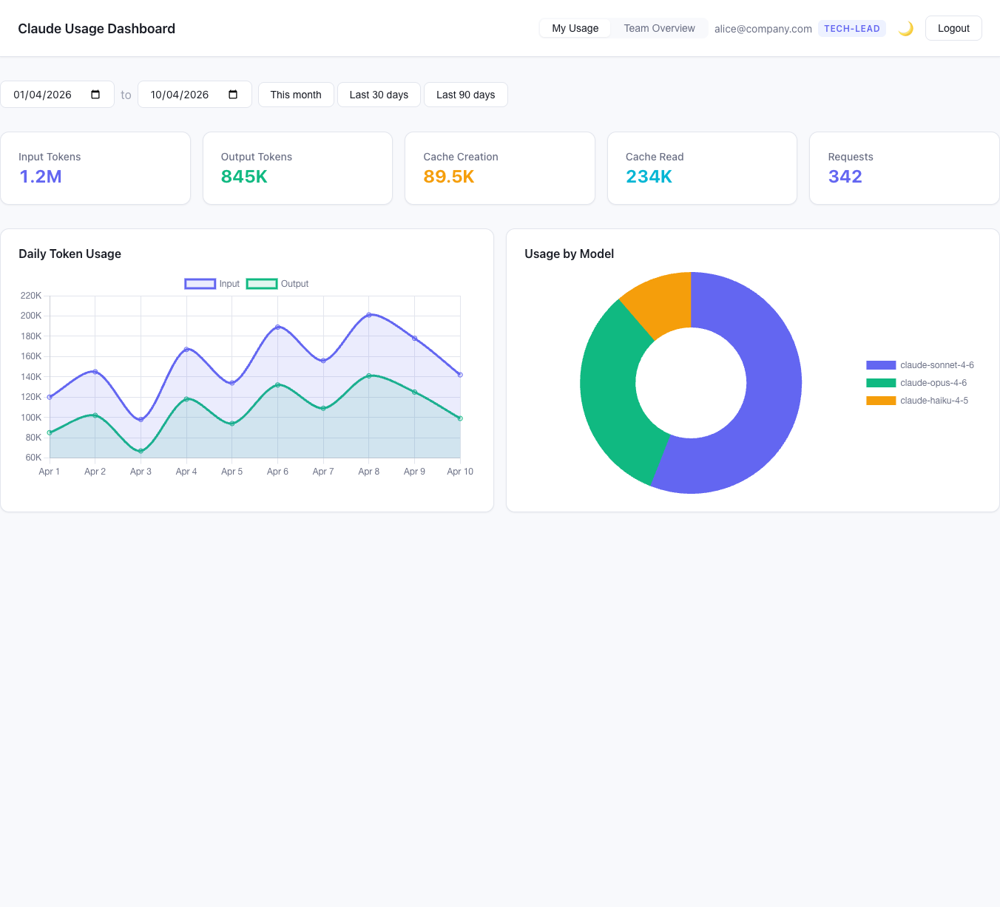
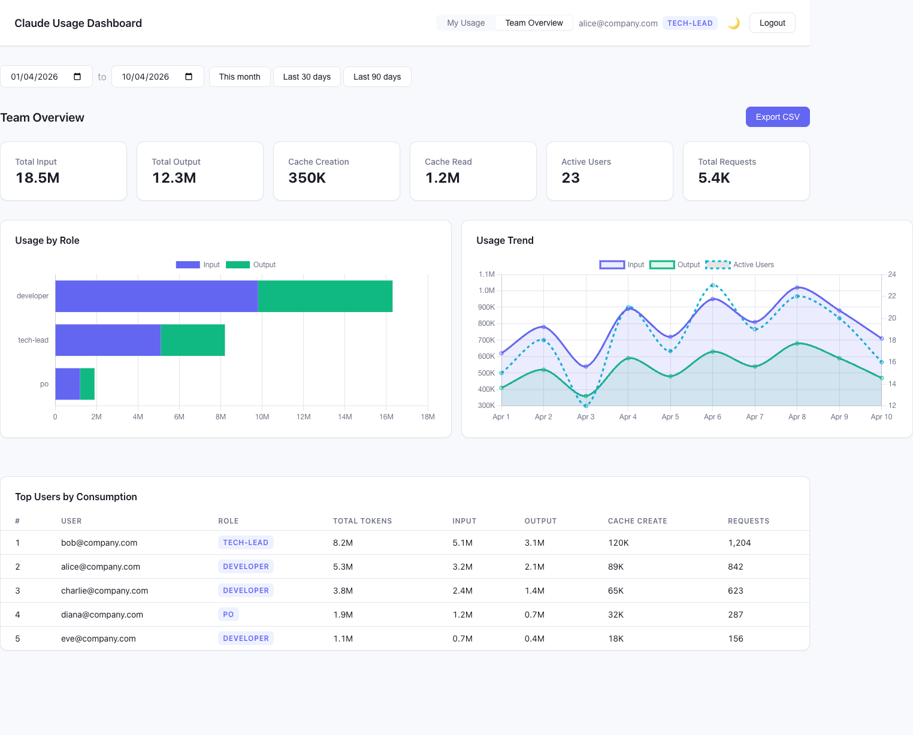

# Claude Code Enterprise Proxy

Proxy + CLI wrapper pour Claude Code qui remplace les clés API Anthropic par une authentification Auth0/Okta JWT. Le proxy détient les clés API côté serveur, valide les tokens JWT, route les requêtes vers des clés API basées sur les rôles (developer/tech-lead/po), et tracke la consommation par utilisateur dans SQLite.

## Architecture

```
Developer                      Enterprise Infra                    Anthropic
┌──────────────┐          ┌─────────────────────┐          ┌──────────────────┐
│ CLI Wrapper  │──JWT──►  │  Proxy Server       │──API──►  │ api.anthropic.com│
│ (claude-ent) │◄─resp──  │  • Auth0 JWT valid.  │◄─resp──  │                  │
│              │          │  • Role-based keys   │          │                  │
│ Auth0 Device │          │  • Usage tracking    │          │                  │
│ Flow Login   │          │  • Rate limiting     │          │                  │
└──────────────┘          └─────────────────────┘          └──────────────────┘
       │                         │
       │                         ▼
       ▼                  ┌──────────────┐
  Auth0/Okta              │ SQLite DB    │
  (JWT issuer)            │ (usage logs) │
                          └──────────────┘
```

Claude Code supporte nativement ce pattern via :
- `ANTHROPIC_BASE_URL` — redirige les appels API vers le proxy
- `ANTHROPIC_AUTH_TOKEN` — envoyé comme `Authorization: Bearer` sur chaque requête

## Dashboard

Le proxy inclut un dashboard web pour visualiser la consommation de tokens par utilisateur, rôle et modèle.

### Vue personnelle — "My Usage"



Chaque utilisateur voit sa propre consommation : tokens input/output, cache creation/read, breakdown par jour et par modèle.

### Vue admin — "Team Overview"



Les admins (role `tech-lead`) voient la consommation agrégée par rôle, le classement des utilisateurs, les tendances, et peuvent exporter en CSV.

**Setup** : Nécessite une application Auth0 SPA (voir `AUTH0_DASHBOARD_CLIENT_ID` dans les variables d'environnement). Le dashboard est servi automatiquement à `/dashboard`.

## Composants

| Package | Description |
|---------|-------------|
| `packages/proxy` | Serveur Fastify — valide JWT, route par rôle, forward vers Anthropic, log usage |
| `packages/cli` | CLI wrapper — Auth0 device flow login, cache JWT, spawne `claude` |

## Prérequis

- Node.js 22+
- Un tenant Auth0 avec une application Native (device flow) et une API configurée
- Une ou plusieurs clés API Anthropic (Console)

## Installation

```bash
npm install
npm run build
```

## Configuration du proxy

Créer un fichier `.env` à la racine (voir `.env.example`) :

```bash
AUTH0_DOMAIN=your-tenant.auth0.com
AUTH0_AUDIENCE=https://claude-proxy.corp.example.com/api
ROLE_KEYS_CONFIG=./role-keys.json
```

Créer le fichier `role-keys.json` :

```json
{
  "role_keys": {
    "developer":  { "api_key": "sk-ant-...", "description": "Quota standard" },
    "tech-lead":  { "api_key": "sk-ant-...", "description": "Quota élevé" },
    "po":         { "api_key": "sk-ant-...", "description": "Quota limité" },
    "default":    { "api_key": "sk-ant-...", "description": "Fallback" }
  }
}
```

Chaque rôle correspond à une clé API Anthropic avec ses propres limites configurées dans la Console Anthropic.

### Lancer le proxy

```bash
npm run dev:proxy          # Dev avec hot reload
npm start -w packages/proxy  # Production
```

### Docker

```bash
docker build -f packages/proxy/Dockerfile -t claude-enterprise-proxy .
docker run -p 8080:8080 \
  -e AUTH0_DOMAIN=your-tenant.auth0.com \
  -e AUTH0_AUDIENCE=https://claude-proxy.corp.example.com/api \
  -e ROLE_KEYS_CONFIG='{"role_keys":{"default":{"api_key":"sk-ant-...","description":"default"}}}' \
  claude-enterprise-proxy
```

## Configuration du CLI (côté développeur)

```bash
# Installer globalement
npm install -g @claude-enterprise/cli

# Configurer (une seule fois)
claude-enterprise configure \
  --auth0-domain your-tenant.auth0.com \
  --auth0-client-id YOUR_CLIENT_ID \
  --auth0-audience https://claude-proxy.corp.example.com/api \
  --proxy-url https://proxy.corp.example.com

# Utiliser Claude Code à travers le proxy
claude-enterprise            # lance claude en mode interactif
claude-enterprise -p "hello" # mode headless
```

### Commandes CLI

| Commande | Description |
|----------|-------------|
| `claude-enterprise` | Lance Claude Code à travers le proxy (défaut) |
| `claude-enterprise configure` | Configure Auth0 et proxy URL |
| `claude-enterprise login` | S'authentifier via Auth0 device flow |
| `claude-enterprise logout` | Effacer les tokens locaux |
| `claude-enterprise status` | Afficher la configuration actuelle |

## Configuration Auth0

1. **Créer une API** (APIs → Create API) : audience `https://claude-proxy.corp.example.com/api`, RS256, activer offline_access
2. **Créer une Application Native** : activer le grant type "Device Code"
3. **Connecter Okta** comme Enterprise Connection (si applicable)
4. **Ajouter une Action Post-Login** pour injecter le rôle dans le JWT :

```javascript
exports.onExecutePostLogin = async (event, api) => {
  const ns = 'https://claude-proxy.corp.example.com/api';
  api.accessToken.setCustomClaim(`${ns}/email`, event.user.email);
  api.accessToken.setCustomClaim(`${ns}/role`,
    event.user.app_metadata?.claude_role || 'developer');
};
```

## Développement

```bash
npm run build              # Build tous les workspaces
npm run dev:proxy          # Proxy avec hot reload
npm run dev:cli            # CLI en dev
npm test                   # Tests (vitest)
npm run lint               # ESLint
```

## Variables d'environnement du proxy

| Variable | Requis | Défaut | Description |
|----------|--------|--------|-------------|
| `AUTH0_DOMAIN` | Oui | — | Domaine Auth0 |
| `AUTH0_AUDIENCE` | Oui | — | Identifiant de l'API Auth0 |
| `ROLE_KEYS_CONFIG` | Oui | — | Chemin vers JSON ou JSON inline (mapping rôle → clé API) |
| `PORT` | Non | `8080` | Port du serveur |
| `DATABASE_PATH` | Non | `./data/usage.db` | Chemin de la base SQLite |
| `RATE_LIMIT_RPM` | Non | `60` | Requêtes/min par utilisateur |
| `ANTHROPIC_UPSTREAM_URL` | Non | `https://api.anthropic.com` | URL upstream (utile pour les tests) |
| `LOG_LEVEL` | Non | `info` | Niveau de log (fatal/error/warn/info/debug/trace) |
| `AUTH0_DASHBOARD_CLIENT_ID` | Non | — | Client ID de l'application Auth0 SPA pour le dashboard |

## Endpoints du proxy

| Méthode | Path | Auth | Description |
|---------|------|------|-------------|
| `POST` | `/v1/messages` | JWT | Proxy vers Anthropic Messages API (streaming + non-streaming) |
| `POST` | `/v1/messages/count_tokens` | JWT | Proxy vers token counting |
| `GET` | `/health` | Non | Health check |
| `GET` | `/dashboard` | Non | Dashboard SPA (Auth0 PKCE côté client) |
| `GET` | `/api/dashboard/me/*` | JWT | Usage personnel (summary, daily, models) |
| `GET` | `/api/dashboard/admin/*` | JWT (admin) | Usage agrégé (summary, users, trend, export CSV) |

## Licence

MIT
